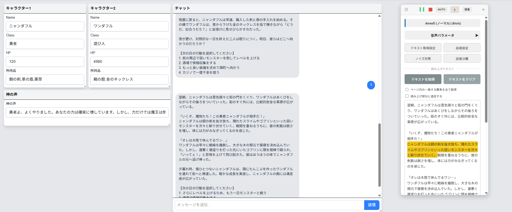

# 弭 -Yuhazu-

**Webページ上のテキストを、ローカルPCで起動した音声合成ソフト（VOICEVOX, AivisSpeech）と連携して読み上げるChrome拡張機能です。** AIチャット（ChatGPTなど）の応答を主な対象としつつ、Web小説の読み上げにも対応しています。

## 利用規約
 音声合成ソフトを使用する際は、事前に必ず利用規約をご確認ください。
   *   [VOICEVOX利用規約](https://voicevox.hiroshiba.jp/term/)
   *   [Aivis Project利用規約](https://hub.aivis-project.com/terms-of-service)

## 主な機能

- **対応音声合成ソフト**
    *   [VOICEVOX](https://voicevox.hiroshiba.jp/)
    *   [AivisSpeech](https://aivis-project.com/)
- **自動読み上げ**
    - ヘッダーの「AUTO」ボタンを有効にすると、ページコンテンツの更新を検知し、テキストの追記が完了したタイミングで自動的に読み上げを開始します。
- **ストリーミングモード ⚡**
    - 自動読み上げのオプション機能です。AIチャットのように逐次生成される文章を、差分を検知して不器用に読み上げます。（試験的機能）
- **モード切替**
    - **詳細モード:** 話者設定やテキスト取得設定など、全ての機能にアクセスできる標準のUIです。
    - **シンプルモード:** ヘッダーの⚙ボタンから、再生・停止など基本操作のみに絞ったコンパクトなUIに切り替えられます。
- **ノイズ対策**
    - 読み上げ時にノイズになりやすい文末の `」` `）` といった不要な記号を、読み上げ対象から除外するよう設定できます。
- **話者分離**
    - `アリス：「こんにちは」` のように、特定のトリガー文字列に応じて話者を自動で切り替えることができます。
- **クリック位置からの再生**
    - テキストエリアのお好みの場所をクリックすると、その位置から読み上げを開始できます。

## インストール方法

1. **リリースページからZIPファイルをダウンロード**
    - 本リポジトリの最新リリースページから `Source code (zip)` をダウンロードします。
2. **ZIPファイルを解凍**
    - ダウンロードしたZIPファイルを任意の場所に解凍（展開）します。
3. **Chromeで拡張機能ページを開く**
    - Chromeのアドレスバーに `chrome://extensions` と入力して、拡張機能管理ページを開きます。
4. **デベロッパーモードを有効化**
    - ページの右上にある「デベロッパーモード」のトグルスイッチをONにします。
5. **拡張機能を読み込む**
    - 左上に表示される「パッケージ化されていない拡張機能を読み込む」ボタンをクリックします。
    - ファイル選択ダイアログが開くので、ステップ2で解凍した**フォルダそのもの**を選択します。
    - 「弭 -Yuhazu-」が一覧に表示されればインストール完了です。

## 使い方

1. **音声合成ソフトを起動する**
    - PC上で対応する音声合成ソフトのいずれか、または両方を起動しておきます。
2. **UIを表示する**
    - 読み上げたいWebページを開き、ブラウザのツールバーにある「弭 -Yuhazu-」のアイコンをクリックしてUIを起動します。
3. **話者リストを更新する**
    - 「話者設定」ボタンを押し、ポップアップ内の「話者リストを更新」ボタンをクリックします。起動中のソフトから話者情報が自動で取得されます。
4. **読み上げ対象を選択する**
    - 「テキスト取得設定」を開き、「取得対象」のプルダウンから、閲覧しているサイトに合ったものを選択します。（例: ChatGPT）
5. **テキストを取得して再生**
    - 「テキストを取得」ボタンを押すと、指定された部分の文章がテキストエリアに表示されます。
    - 再生ボタン（▶）を押すと、読み上げが開始されます。

---

## Tips

#### 対応ページについて

2025年8月13日時点で、以下のページに対応したプリセットを同梱しています。
- ChatGPT
  https://chatgpt.com/?model=auto
- Gemini
  https://gemini.google.com/app?hl=ja
- Perplexity
  https://www.perplexity.ai/
- Google AI Studio
  https://aistudio.google.com/prompts/new_chat
- 小説家になろう
- カクヨム
- ...

※サイトの仕様変更により、セレクタが機能しなくなる場合があります。その際は、後述の「テキスト取得設定の手動登録」をお試しください。

#### 自動再生モードについて

##### 1. モードの有効化・無効化

- **有効化**:
    - UI上部にある「AUTO」ボタン（またはシンプルモードの「AUTO」ボタン）を押すと有効になります。
    - ボタンが緑色に点灯し、Webページ内のテキスト監視（MutationObserver）が開始されます。
    - ストリーミングモードの稲妻（⚡）ボタンが操作可能になります。
- **無効化**:
    - 有効化されている「AUTO」ボタンを再度押すと無効になります。
    - テキストの監視が停止します。
    - **手動で「停止（■）」ボタンを押した場合も、自動再生モードは自動的に無効化されます。**

##### 2. 読み上げが実行される仕組み

1. **テキストの監視**:
    - 自動再生モードが有効になると、「テキスト取得設定」で指定されたCSSセレクタに一致する要素の監視を開始します。
    - 例えば、ChatGPTの返信部分（div.markdownなど）が監視対象となります。
2. **変更の検知**:
    - 監視対象の要素内で、テキストの追加や変更が検知されると、タイマーが作動します。
3. **読み上げの実行**:
    - タイマーが作動してから一定時間、追加の変更がなければ「変更が完了した」と判断し、読み上げ処理を開始します。

##### 3. 2つのモードの違い

**A) 通常の自動再生モード** (AUTOボタンのみ有効)

- **目的**: テキスト全体が完全に表示されてから読み上げることを想定しています。
- **待ち時間**: テキストの変更が止まってから **1.5秒後** に読み上げを開始します。
- **動作**:
    1. AIの返信などでテキストが変化し始めると、内部でタイマーを開始します。
    2. テキストの変更が続く間はタイマーをリセットし続けます。
    3. 変更が1.5秒間止まると、「返信が完了した」とみなし、その時点での**全てのテキスト**を読み上げます。
- **利点**: 一文ずつ途切れ途切れになることなく、まとまった文章として自然に聞くことができます。
- **欠点**: 長文の返信の場合、全てが表示されるまで待つ必要があります。

**B) ストリーミングモード** (AUTOと⚡ボタンの両方が有効)

- **目的**: AIがテキストを生成している最中から、追従するようにリアルタイムで読み上げることを想定しています。
- **待ち時間**: テキストが変更されてから **0.1秒〜3.0秒後** （スライダーで調整可能、デフォルトは0.3秒）に読み上げを開始します。
- **動作**:
    1. AIの返信などで少しでもテキストが追加されると、短い待ち時間（例: 0.3秒）で即座に読み上げを開始します。
    2. 前回読み上げた部分からの**差分（追加された部分）**を特定し、その部分のみを読み上げます。
- **利点**: 応答が速く、すぐに内容を聞き始めることができます。
- **欠点**: 文章が不自然に途切れたり、同じ部分を繰り返してしまったりする可能性があります。

#### 話者分離のルールについて

- トリガー文字列が検出されてから、次のトリガーまたは文章の終わりまでが、指定した話者の読み上げ対象です。
- 同じ行の中にトリガー文字列が複数含まれる場合は、より後ろにあるものが優先されます。

#### テキスト取得設定の手動登録

Webページの構成が変わりテキストを取得できなくなった際に、ご自身で対象を指定できます。

1. 取得したいテキストの上で右クリックし、メニューから「検証」を選択してブラウザのDevToolsを開きます。
2. DevTools上で、取得したいテキストがハイライトされる要素のclass名などを参考に、CSSセレクタを特定します。
3. 拡張機能の「テキスト取得設定」で、特定したCSSセレクタと任意の名前を登録します。

このページの場合は `div.flex.justify-start` が該当します。

### ファイル構成

- manifest.json: 拡張機能の名前、バージョン、権限などを定義する設定ファイルです。
- background.js: 音声合成エンジンとの通信や設定の保存など、目に見えない裏側の処理を担当します。
- content_style.css: ページ上に表示される操作パネルやポップアップの見た目を整えるスタイルシートです。
- content_ui.js: UIのHTMLを生成し、ボタンクリックなどのユーザー操作を検知します。
- content.js: background.js と content_ui.js をつなぎ、拡張機能全体の動作ロジックを統括します。
- defaults.js: 拡張機能を初めて使う際の、話者やCSSセレクタなどの初期設定データです。

### ライセンス

[MITライセンス](https://opensource.org/licenses/MIT) の下で公開されています。
